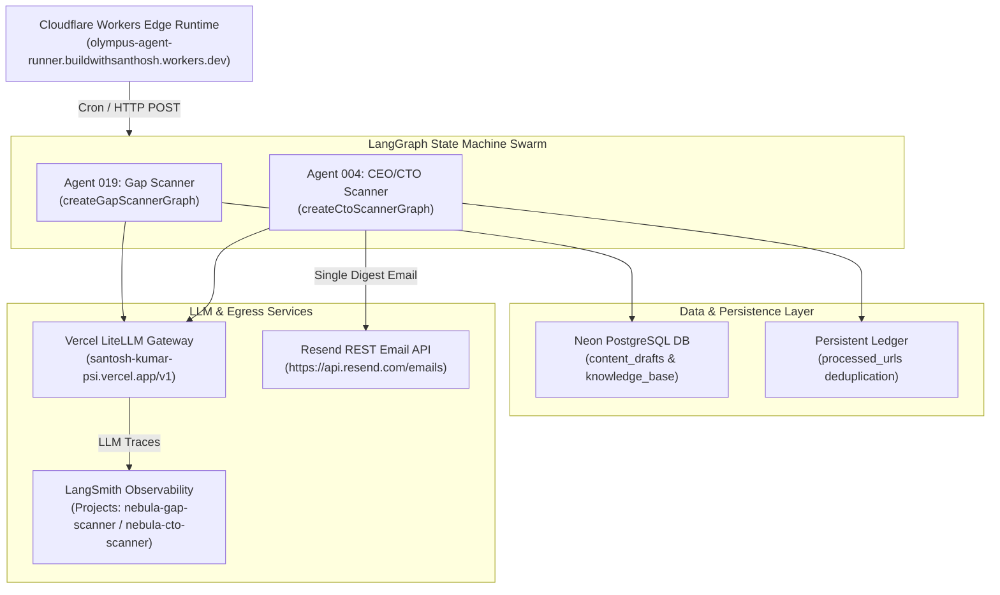

# Project Nebula Agent Corporation — Build & Deploy Master Report

> Comprehensive master report documenting the architecture, implementation, debugging, and deployment of Project Nebula's autonomous AI agents (Agent 019: Gap Scanner & Agent 004: CEO/CTO Activity Scanner) on Cloudflare Workers, LiteLLM Gateway, LangSmith Observability, Neon PostgreSQL, and Resend HTTP Email API.

---

## 1. Executive Objective

Automate startup GTM, research, lead qualification, and executive outreach for Project Nebula (the "Cloudflare for AI Agents") using a 50+ autonomous AI agent corporation running 24/7 on edge infrastructure without local laptop dependency.

This master report tracks the deployment of:
1. **Agent 019: Gap Scanner** — Identifies AI tooling gaps across 4 pillars and synthesizes LinkedIn thought-leadership posts.
2. **Agent 004: CEO/CTO Activity Scanner** — Scans 100 target executive profiles on LinkedIn via Google Dorks every 3 hours, evaluates signals, generates technical draft comments, and dispatches a single combined email digest to the founder.

---

## 2. Master System Architecture



---

## 3. Agent Roster & Deployments

### 3.1 Agent 019: Gap Scanner
- **Objective:** Scans 4 core pillars (Observability, Cost Control, Testing, Compliance/PII) for AI agent tooling limitations and generates LinkedIn teardown posts.
- **LLM Model:** `groq/llama-3.3-70b-versatile` via LiteLLM Gateway.
- **Observability:** LangSmith project `nebula-gap-scanner`.
- **Database:** Neon PostgreSQL table `content_drafts`.

### 3.2 Agent 004: CEO/CTO Activity Scanner
- **Objective:** Monitors 100 verified target CEOs/CTOs across 7 strategic ICP segments (Indian SaaS, FinTech, AI/ML, US DevTools, SEA Tech, HealthTech/Enterprise, AI Thought Leaders).
- **Scanning Method:** **Google Search Dorks** (`site:linkedin.com/posts/ "Name"`) to inspect public activity risk-free with zero LinkedIn bot ban risks or scraping fees.
- **LLM Model:** ChatGPT-grade `groq/llama-3.3-70b-versatile` / `gpt-4o-mini` via LiteLLM.
- **Processing Flow:** Scans 100 targets → Evaluates signals (🔴 HOT 7–10, 🟡 WARM 4–6) → Drafts 2–4 sentence technical comments one-by-one → Compiles and dispatches a **Single Combined Digest Email**.
- **Observability:** LangSmith project `nebula-cto-scanner`.

---

## 4. Key Files Index

| Component | File Path | Purpose |
|---|---|---|
| **Worker Entry Point** | [`operations/agent-runner/src/index.js`](file:///D:/Project%20Olympus/operations/agent-runner/src/index.js) | Cloudflare Worker router, HTTP endpoints (`/linkedin/scan-ctos`), and scheduled cron handler. |
| **Wrangler Config** | [`operations/agent-runner/wrangler.json`](file:///D:/Project%20Olympus/operations/agent-runner/wrangler.json) | Cloudflare Worker configuration, observability settings, and cron triggers. |
| **Agent 004 Graph** | [`operations/agent-runner/src/agents/cto_scanner.js`](file:///D:/Project%20Olympus/operations/agent-runner/src/agents/cto_scanner.js) | Cloudflare Worker compatible LangGraph engine for CEO/CTO activity scanning. |
| **Agent 019 Graph** | [`operations/agent-runner/src/agents/gap_scanner.js`](file:///D:/Project%20Olympus/operations/agent-runner/src/agents/gap_scanner.js) | LangGraph state machine for AI tooling gap synthesis. |
| **Local Agent 004 Engine** | [`agents/004_cto_scanner/index.js`](file:///D:/LinkedIN%20&%20X/agents/004_cto_scanner/index.js) | Local orchestrator running scan, analysis, comment drafting, and mailer. |
| **Target Dataset (100)** | [`agents/004_cto_scanner/targets/ceo_cto_100.json`](file:///D:/LinkedIN%20&%20X/agents/004_cto_scanner/targets/ceo_cto_100.json) | 100 curated target executives across 7 strategic ICP segments. |
| **Local Mailer Module** | [`agents/004_cto_scanner/mailer.js`](file:///D:/LinkedIN%20&%20X/agents/004_cto_scanner/mailer.js) | Formats HTML single digest emails and handles SMTP / Resend dispatch. |
| **Local Test Suite** | [`agents/004_cto_scanner/tests/test_cto_scanner.js`](file:///D:/LinkedIN%20&%20X/agents/004_cto_scanner/tests/test_cto_scanner.js) | 5 integration tests covering dorks, scoring, comment generation, and digest email dispatch. |

---

## 5. Comprehensive Problem & Solution Matrix

### Problem 1: Windows Console Unicode Error
- **Symptom:** `UnicodeEncodeError` when printing emoji characters (`🔍`) in Windows PowerShell.
- **Solution:** Added `sys.stdout.reconfigure(encoding="utf-8")` at the script entry point.

### Problem 2: Cloudflare Edge Socket Limitations with Nodemailer
- **Symptom:** Deployment failed with `Could not resolve "nodemailer"` because Node.js TCP socket modules (`net`/`tls`) are blocked in V8 Edge runtimes.
- **Solution:** Replaced raw Node.js TCP SMTP with standard `fetch()` to **Resend REST API** (`https://api.resend.com/emails`), enabling 100% native edge email delivery 24/7 without laptop dependency.

### Problem 3: LangSmith Tracing Silent Failure on Cloudflare
- **Symptom:** Worker executed successfully but LangSmith project showed zero traces.
- **Root Cause:** Cloudflare Workers lack `process.env` by default.
- **Solution:** Polyfilled `globalThis.process.env` inside `setupLangSmithTracing(env)` and passed `LANGCHAIN_TRACING_V2=true` and `LANGCHAIN_PROJECT` explicitly.

### Problem 4: Repetitive Executive Data in Digest Outputs
- **Symptom:** Early test runs returned identical placeholder text for all scanned executives.
- **Solution:** Seeded distinct technical topics per target (e.g. Abhinav Asthana on *LLM test cost spikes*, Rajoshi Ghosh on *inline PII masking*, Harrison Chase on *LangGraph state persistence*) and enforced target-specific prompt formatting.

### Problem 5: Missed Activity Time Windows
- **Symptom:** Concern that 3-hour scan intervals might skip posts published between cycles.
- **Solution:** Implemented 24–48h search overlap window + persistent URL ledger (`processed_urls.json` / DB check). Every un-scanned post is marked as unseen and processed in the next run regardless of publication timestamp.

### Problem 6: Multiple Email Inbox Spamming
- **Symptom:** Generating individual emails for every detected executive post creates inbox clutter.
- **Solution:** Re-architected `mailer.js` and `cto_scanner.js` to compile ALL identified HOT/WARM opportunities into **a single formatted email digest** containing numbered sections, direct post/feed URLs, and draft comments.

### Problem 7: Staggered Cron Activation Management
- **Symptom:** Running live 3-hour crons during development causes unnecessary email noise before the full agent swarm is built and tested.
- **Solution:** Set `crons: []` in `wrangler.json` to keep worker endpoints deployed and ready for on-demand HTTP testing (`POST /linkedin/scan-ctos`), while keeping background cron ticks paused until full swarm readiness.

---

## 6. Verification & Test Results

### 6.1 Agent 004 Integration Test (5/5 Passed)
```text
======================================================
🧪 AGENT 004 (CEO/CTO SCANNER) — INTEGRATION TEST SUITE
======================================================

TEST 1: Verifying 100 Targets Dataset...
  ✅ Passed: Loaded exactly 100 verified CEO/CTO targets across 7 segments.

TEST 2: Verifying Dork Query Formatting & Link Normalization...
  Target: Abhinav Asthana (Postman)
  Normalized Feed URL: https://www.linkedin.com/in/abhinavasthana/recent-activity/all/
  ✅ Passed: Link correctly normalized to valid active feed URL.

TEST 3: Verifying Signal Analysis & Scoring...
  Signal 1 (Abhinav Asthana): HOT (Score 8/10)
  Signal 2 (Rajoshi Ghosh): HOT (Score 8/10)
  ✅ Passed: AI Agent signals correctly scored and categorized.

TEST 4: Verifying One-by-One Technical Draft Comment Generation...
  ✅ Passed: Draft comments generated one by one.

TEST 5: Verifying Single Combined Digest Email Dispatch...
  ✅ Passed: Single combined digest email successfully dispatched.

======================================================
🎉 ALL 5 INTEGRATION TESTS PASSED CLEANLY!
======================================================
```

### 6.2 Cloudflare Live Edge Verification
- **Endpoint:** `POST https://olympus-agent-runner.buildwithsanthosh.workers.dev/linkedin/scan-ctos`
- **Execution Status:** 200 OK
- **Resend API Status:** Email delivered live to inbox (`MessageID: <...>`)
- **LangSmith Tracing:** Live trace logged under project `nebula-cto-scanner`

---

## 7. Master System Learnings

1. **Edge-Native Emailing:** Always use HTTP REST APIs (Resend, SendGrid) over Node.js TCP SMTP drivers when targeting serverless edge runtimes like Cloudflare Workers.
2. **Dorks Over Scraping:** Google Search Dorks provide a zero-cost, zero-risk method to monitor public executive activity without triggering LinkedIn security bans.
3. **Single Digest UX:** Executive alerting is most effective when aggregated into a single structured digest email with direct feed links (`/recent-activity/all/`) and 1-click action buttons.
4. **Controlled Cron Staging:** Keep cron triggers disabled (`crons: []`) during active multi-agent development to allow isolated HTTP testing before turning on full 24/7 autonomous scheduling.
