# 🏛️ Project Olympus — The Autonomous Agent Corporation

## Deep Research: 50+ AI Agents Running Nebula While You Sleep

**Author:** Deep Research Engine (3 Parallel Research Agents)
**Date:** July 23, 2026
**Classification:** Founder Strategy — Confidential

---

> [!IMPORTANT]
> This document is the master blueprint for automating every function of Nebula's pre-seed startup operations using 50+ autonomous AI agents, running 24/7 on free-tier infrastructure (Google AI Studio + Groq + Cloudflare + Vercel). It maps every startup role to an agent, defines the architecture, and provides a concrete implementation roadmap for landing CEO/CTO contracts, acquiring design partners, and closing pre-seed funding — all while you sleep.

---

## Table of Contents

1. [The Vision: A Solo Founder's AI Corporation](#1-the-vision)
2. [Agent Architecture: The Control Plane](#2-agent-architecture)
3. [The 50+ Agent Org Chart](#3-the-org-chart)
4. [LinkedIn Automation Command Center](#4-linkedin-automation)
5. [The CEO/CTO Contract Acquisition Machine](#5-contract-acquisition)
6. [Design Partner Acquisition Pipeline](#6-design-partner-pipeline)
7. [Pre-Seed Fundraising Automation](#7-fundraising-automation)
8. [Free-Tier Infrastructure Blueprint](#8-infrastructure)
9. [LiteLLM + Multi-Provider Routing](#9-litellm-routing)
10. [Cloudflare Deployment Architecture](#10-cloudflare-deployment)
11. [Memory, State & Knowledge Management](#11-memory-management)
12. [Safety, Guardrails & Human-in-the-Loop](#12-safety)
13. [KPIs & Monitoring Dashboard](#13-kpis)
14. [Implementation Roadmap](#14-roadmap)

---

## 1. The Vision: A Solo Founder's AI Corporation {#1-the-vision}

You are Santhosh Kumar N, a 19-year-old founder building Nebula — the "Cloudflare for AI Agents." You have:

- A [complete PRD](file:///d:/Project%20Olympus/docs/35_docs_nebula_master_prd.md) and [TRD](file:///d:/Project%20Olympus/docs/36_docs_nebula_master_trd.md)
- A [4-stage GTM pipeline](file:///d:/Project%20Olympus/docs/54_docs_nebula_linkedin_gap_solution_content_engine.md) (LinkedIn → Substack → Slack → Concierge Audit → LOI)
- A [Rust prototype](file:///d:/Project%20Olympus/src/42_src_main.rs) with Axum proxy, DFA scanner, and budget controller
- [Cold message templates](file:///d:/Project%20Olympus/ideas/cold-message-templates), [advisor agreements](file:///d:/Project%20Olympus/ideas/advisor-agreement-fast), [recruiter scripts](file:///d:/Project%20Olympus/ideas/recruiter-response-template)
- A ₹1-2 Crore pre-seed ask targeting 15-20 design partner LOIs

**The Problem:** You are one person. Your GTM requires weekly LinkedIn posts, daily engagement, weekly Substack newsletters, daily connection requests, daily comment engagement, lead qualification, diagnostic report generation, advisor outreach, investor research, and more. This is a **full-time job for 5+ people.**

**The Solution:** Build a 50+ agent corporation where each agent operates as a specialized "employee" with clear objectives, KPIs, and reporting lines. The agents run autonomously on free-tier LLM infrastructure while you sleep, and you wake up to:
- New LinkedIn connections with CTOs/CISOs
- Engagement on your posts
- Qualified leads in your CRM
- Draft diagnostic reports ready for review
- Investor match lists
- Daily performance reports

---

## 2. Agent Architecture: The Control Plane {#2-agent-architecture}

### 2.1 Framework Selection: LangGraph as the Backbone

After evaluating all major frameworks, **LangGraph** is the clear winner for your 50+ agent system:

| Framework | 50+ Agent Readiness | Why |
|---|---|---|
| **LangGraph** ✅ | ★★★★★ | Stateful graphs, durable execution, human-in-the-loop checkpoints, time-travel debugging, production-grade |
| CrewAI | ★★★☆☆ | Great for prototyping role-based teams, but needs custom governance for 50+ agents |
| AutoGen | ★★☆☆☆ | Maintenance mode; superseded by Microsoft's newer Agent Framework |
| Agency Swarm | ★★☆☆☆ | Experimental; peer-to-peer focus, not hierarchical management |
| MetaGPT | ★★☆☆☆ | Specialized for software engineering only |

### 2.2 The Three-Layer Architecture

Your agent corporation operates on a three-layer architecture inspired by corporate hierarchy:

```
┌─────────────────────────────────────────────────────────────────────────┐
│                    LAYER 1: THE CONTROL PLANE                          │
│  ┌───────────────┐  ┌──────────────────┐  ┌─────────────────────────┐  │
│  │ CEO Strategist │  │ Policy Governor  │  │ Budget Controller       │  │
│  │ Agent          │  │ (Guardrails)     │  │ (Cost Circuit Breaker)  │  │
│  └───────┬───────┘  └────────┬─────────┘  └────────────┬────────────┘  │
│          │                   │                          │               │
├──────────┼───────────────────┼──────────────────────────┼───────────────┤
│          │     LAYER 2: DEPARTMENT MANAGERS              │               │
│  ┌───────▼───────────────────▼──────────────────────────▼─────────────┐ │
│  │                    LangGraph Supervisor Node                       │ │
│  │  Routes tasks to Department Heads based on priority queues         │ │
│  └───┬──────┬──────┬──────┬──────┬──────┬──────┬──────┬──────┬──────┘ │
│      │      │      │      │      │      │      │      │      │        │
│   ┌──▼──┐┌──▼──┐┌──▼──┐┌──▼──┐┌──▼──┐┌──▼──┐┌──▼──┐┌──▼──┐┌──▼──┐   │
│   │Sales││Mktg ││Cont ││Prod ││Recr ││Fin  ││Cust ││Data ││Tech │   │
│   │Mgr  ││Mgr  ││Mgr  ││Mgr  ││Mgr  ││Mgr  ││Succ ││Anal ││Mgr  │   │
│   └──┬──┘└──┬──┘└──┬──┘└──┬──┘└──┬──┘└──┬──┘└──┬──┘└──┬──┘└──┬──┘   │
│      │      │      │      │      │      │      │      │      │        │
├──────┼──────┼──────┼──────┼──────┼──────┼──────┼──────┼──────┼────────┤
│      │  LAYER 3: SPECIALIST WORKERS (50+ Agents)       │      │        │
│  ┌───▼──┐  ┌▼────┐ ┌▼────┐                                           │
│  │SDR #1│  │Post │ │Gap  │  ... 40+ more specialized worker agents    │
│  │SDR #2│  │Wrtr │ │Scan │                                            │
│  │SDR #3│  │#1-5 │ │ner  │                                            │
│  └──────┘  └─────┘ └─────┘                                            │
└─────────────────────────────────────────────────────────────────────────┘
```

### 2.3 Communication Patterns

Agents communicate via **asynchronous event-driven architecture (EDA)**, not synchronous polling:

| Pattern | Use Case | Implementation |
|---|---|---|
| **Message Queues** (Point-to-Point) | Task distribution to worker agents | Cloudflare Queues or in-memory task queues |
| **Pub/Sub** (Broadcast) | Event broadcasting (e.g., "new lead qualified") | Cloudflare Pub/Sub or Redis Pub/Sub |
| **Shared State** | Persistent agent state across restarts | LangGraph checkpointers + Cloudflare D1 |
| **A2A Protocol** | Cross-agent delegation contracts | Standardized input/output JSON schemas |

### 2.4 Delegation Contracts

Every agent-to-agent handoff uses a strict **Delegation Contract**:

```json
{
  "task_id": "uuid",
  "from_agent": "Sales_Manager",
  "to_agent": "SDR_Agent_03",
  "task": "send_connection_request",
  "input_schema": {
    "target_name": "string",
    "target_title": "string",
    "target_company": "string",
    "personalized_note": "string (<300 chars)"
  },
  "expected_output_schema": {
    "status": "sent | failed | rate_limited",
    "timestamp": "ISO8601",
    "error_reason": "string | null"
  },
  "deadline": "2026-07-24T00:00:00Z",
  "priority": "HIGH",
  "max_retries": 3,
  "budget_limit_tokens": 5000
}
```

---

## 3. The 50+ Agent Org Chart {#3-the-org-chart}

### 3.1 Complete Agent Roster

Below is the complete roster of agents mapped to Nebula's specific needs, your existing GTM playbooks, and your pre-seed objectives.

---

### 🏢 C-Suite (3 Agents) — Layer 1: Control Plane

#### Agent 001: CEO Strategist
- **Objective:** Decompose weekly goals into department-level tasks, monitor cross-department KPIs, make strategic routing decisions
- **Runs:** Daily at 6:00 AM IST (before you wake up)
- **Inputs:** Previous day's KPI report from Data Analyst, market signals, calendar
- **Outputs:** Daily task allocation to all 9 department managers
- **Tools:** Calendar API, Notion/Google Sheets, Email summary
- **LLM:** Gemini 2.5 Pro (complex reasoning)

#### Agent 002: Policy Governor
- **Objective:** Enforce guardrails across all agents — content moderation, LinkedIn compliance, brand voice consistency
- **Runs:** Always-on (intercepts before any external action)
- **Inputs:** All outbound content (posts, DMs, emails, comments)
- **Outputs:** Approved/Rejected/Modified content
- **Tools:** Content moderation rules, brand voice guidelines from [LinkedIn Engine](file:///d:/Project%20Olympus/docs/54_docs_nebula_linkedin_gap_solution_content_engine.md)
- **LLM:** Gemini 2.0 Flash (fast approval/rejection)

#### Agent 003: Budget Controller
- **Objective:** Track token spend across all agents, enforce daily budget caps, circuit-break runaway agents
- **Runs:** Always-on (wraps every LLM call)
- **Inputs:** Token usage from LiteLLM proxy
- **Outputs:** Budget reports, kill signals for over-budget agents
- **Tools:** LiteLLM budget API, Cloudflare KV for real-time counters
- **LLM:** None (pure logic, no LLM needed)

---

### 📊 Department Managers (9 Agents) — Layer 2

#### Agent 004: Head of Sales & BD
- **Objective:** Manage the outbound pipeline targeting CTOs/CISOs, qualify leads, coordinate SDR agents
- **Runs:** Every 4 hours
- **KPIs:** Pipeline velocity, qualified leads per week, meeting-booked rate
- **Manages:** SDR Agents (010-014), Lead Scorer (015)

#### Agent 005: Head of Marketing
- **Objective:** Orchestrate LinkedIn content strategy, coordinate content writers, manage posting schedule
- **Runs:** Daily at 7:00 AM IST
- **KPIs:** Post impressions, engagement rate, follower growth, Substack subscribers
- **Manages:** LinkedIn Content Writers (016-020), Gap Scanner (021), Comment Engager (022-024)

#### Agent 006: Head of Content
- **Objective:** Manage Substack newsletter, blog posts, case studies, and diagnostic report drafting
- **Runs:** Weekly (Sunday) + on-demand for diagnostic reports
- **KPIs:** Newsletter open rate (target: 45%), content volume, subscriber growth
- **Manages:** Newsletter Writer (025), Case Study Writer (026), Diagnostic Drafter (027-029)

#### Agent 007: Product Manager
- **Objective:** Synthesize design partner feedback, prioritize feature backlog, translate market signals into PRD updates
- **Runs:** Weekly + event-driven (when feedback arrives)
- **KPIs:** Feature shipping velocity, feedback synthesis time
- **Manages:** Feedback Synthesizer (030), Competitor Watcher (031)

#### Agent 008: Head of Recruitment & Partnerships
- **Objective:** Source advisors, design partners, and potential co-founders per the [Advisory Playbook](file:///d:/Project%20Olympus/docs/37_docs_nebula_advisory_and_job_roles_playbook.md)
- **Runs:** Daily
- **KPIs:** Advisor pipeline size, design partner LOIs signed
- **Manages:** Advisor Sourcer (032-033), Design Partner Hunter (034-035)

#### Agent 009: CFO & Fundraising Lead
- **Objective:** Research investors, match by thesis, generate personalized pitch materials, track fundraising pipeline
- **Runs:** Daily
- **KPIs:** Investor matches found, meetings secured, data room engagement
- **Manages:** Investor Researcher (036-037), Pitch Personalizer (038), Follow-up Sequencer (039)

#### Agent 010: Head of Customer Success
- **Objective:** Manage relationships with active design partners, schedule check-ins, route feedback
- **Runs:** Daily + event-driven
- **KPIs:** NPS, support ticket resolution time, partner retention
- **Manages:** Partner Communication Agent (040), Feedback Router (041)

#### Agent 011: Chief Data Officer
- **Objective:** Generate daily/weekly performance reports, track cross-department KPIs, flag anomalies
- **Runs:** Daily at 5:00 AM IST (so CEO Strategist has data at 6 AM)
- **KPIs:** Report accuracy, anomaly detection rate
- **Manages:** LinkedIn Analytics Agent (042), Pipeline Analytics Agent (043), Metric Aggregator (044)

#### Agent 012: CTO / Technical Lead
- **Objective:** Monitor prototype health, review PRs, manage technical documentation, coordinate with Rust engineers
- **Runs:** Daily + event-driven (GitHub webhooks)
- **KPIs:** PR merge time, bug detection rate, infrastructure uptime
- **Manages:** Code Reviewer (045), Documentation Agent (046), CI/CD Monitor (047)

---

### ⚡ Specialist Workers (38+ Agents) — Layer 3

#### Sales & BD Workers

| ID | Agent | Schedule | Task | Target Output |
|---|---|---|---|---|
| 013 | SDR Agent #1 | Daily 9 AM | LinkedIn connection requests to CTOs | 15-20 personalized requests/day |
| 014 | SDR Agent #2 | Daily 10 AM | LinkedIn connection requests to CISOs | 15-20 personalized requests/day |
| 015 | SDR Agent #3 | Daily 11 AM | LinkedIn connection requests to VP Eng | 15-20 personalized requests/day |
| 016 | SDR Agent #4 | Daily 2 PM | Follow-up DMs to accepted connections | 10-15 follow-ups/day |
| 017 | SDR Agent #5 | Daily 3 PM | Email outreach to Slack community leads | 5-10 emails/day |
| 018 | Lead Scorer | Hourly | Score new connections using [Qualification Matrix](file:///d:/Project%20Olympus/docs/57_docs_nebula_concierge_audit_conversion_pipeline.md) | Scored leads in CRM |

#### Marketing & LinkedIn Workers

| ID | Agent | Schedule | Task | Target Output |
|---|---|---|---|---|
| 019 | Gap Scanner | Sunday 10 AM | Scan GitHub Issues, Reddit, HN for gaps per [Gap Sourcing](file:///d:/Project%20Olympus/docs/54_docs_nebula_linkedin_gap_solution_content_engine.md) | 3-5 gap candidates logged |
| 020 | LinkedIn Post Writer #1 | Monday 6 AM | Draft main gap-solution post using [template](file:///d:/Project%20Olympus/docs/54_docs_nebula_linkedin_gap_solution_content_engine.md) | 1 polished post draft |
| 021 | LinkedIn Post Writer #2 | Thursday 6 AM | Draft lighter post (poll/carousel/quote-comment) | 1 lighter format post |
| 022 | LinkedIn Post Writer #3 | Bi-weekly | Draft personal story / build-in-public post | 1 narrative post |
| 023 | LinkedIn Post Writer #4 | Weekly | Draft industry analysis / thought leadership | 1 analysis post |
| 024 | LinkedIn Post Writer #5 | On-demand | Draft event-reaction / trending topic post | Reactive posts |
| 025 | Comment Engager #1 | Every 2 hours | Monitor and reply to comments on YOUR posts | Thoughtful replies within 60 min |
| 026 | Comment Engager #2 | Every 3 hours | Comment on target CTO/CISO posts with expertise | 5-10 strategic comments/day |
| 027 | Comment Engager #3 | Daily | Engage with Tier 2 influencer posts (DevRel leads) | 3-5 influencer engagements/day |

#### Content Workers

| ID | Agent | Schedule | Task | Target Output |
|---|---|---|---|---|
| 028 | Substack Newsletter Writer | Friday 6 PM | Compile week's best gap into newsletter draft | 1 newsletter draft |
| 029 | Case Study Writer | Bi-weekly | Draft case studies from diagnostic data | 1 case study |
| 030 | Diagnostic Report Drafter #1 | On-demand | Generate [AI Agent Architecture Diagnostic](file:///d:/Project%20Olympus/docs/57_docs_nebula_concierge_audit_conversion_pipeline.md) reports | Personalized diagnostic |
| 031 | Diagnostic Report Drafter #2 | On-demand | Second diagnostic drafter for parallel processing | Personalized diagnostic |
| 032 | Diagnostic Report Drafter #3 | On-demand | Third diagnostic drafter for high-volume weeks | Personalized diagnostic |

#### Product & Research Workers

| ID | Agent | Schedule | Task | Target Output |
|---|---|---|---|---|
| 033 | Feedback Synthesizer | Weekly | Analyze design partner feedback, update PRD suggestions | Feature priority report |
| 034 | Competitor Watcher | Daily | Monitor Langfuse, LangSmith, Helicone GitHub/blogs for changes | Competitive intelligence brief |

#### Recruitment & Partnership Workers

| ID | Agent | Schedule | Task | Target Output |
|---|---|---|---|---|
| 035 | Advisor Sourcer #1 | Daily | LinkedIn boolean search for [Persona 1-2](file:///d:/Project%20Olympus/docs/37_docs_nebula_advisory_and_job_roles_playbook.md) (Systems/Security) | 5-10 advisor candidates/day |
| 036 | Advisor Sourcer #2 | Daily | LinkedIn boolean search for [Persona 3-4](file:///d:/Project%20Olympus/docs/37_docs_nebula_advisory_and_job_roles_playbook.md) (DevTool/CTO) | 5-10 advisor candidates/day |
| 037 | Design Partner Hunter #1 | Daily | Identify companies matching [target criteria](file:///d:/Project%20Olympus/docs/57_docs_nebula_concierge_audit_conversion_pipeline.md) | 3-5 qualified companies/day |
| 038 | Design Partner Hunter #2 | Daily | Research and prepare personalized outreach for identified targets | Outreach packages |

#### Fundraising Workers

| ID | Agent | Schedule | Task | Target Output |
|---|---|---|---|---|
| 039 | Investor Researcher #1 | Daily | Scan AngelList, Crunchbase for AI/infra investors | 5-10 matched investors/day |
| 040 | Investor Researcher #2 | Daily | Deep-dive on matched investors (portfolio, thesis, recent tweets) | Investor profiles |
| 041 | Pitch Personalizer | On-demand | Customize [pitch deck](file:///d:/Project%20Olympus/docs/22_docs_nebula_pitch_deck_content.md) slides per investor's thesis | Personalized deck |
| 042 | Follow-up Sequencer | Daily | Manage investor follow-up email cadences | Automated follow-ups |

#### Analytics & Operations Workers

| ID | Agent | Schedule | Task | Target Output |
|---|---|---|---|---|
| 043 | LinkedIn Analytics Agent | Daily 5 AM | Pull LinkedIn post performance metrics | Daily analytics report |
| 044 | Pipeline Analytics Agent | Daily 5 AM | Generate sales pipeline health report | Pipeline dashboard data |
| 045 | Metric Aggregator | Daily 5:30 AM | Merge all department metrics into CEO brief | Unified daily brief |

#### Technical Workers

| ID | Agent | Schedule | Task | Target Output |
|---|---|---|---|---|
| 046 | Code Reviewer | Event-driven | Review GitHub PRs against [TRD standards](file:///d:/Project%20Olympus/docs/36_docs_nebula_master_trd.md) | PR review comments |
| 047 | Documentation Agent | Weekly | Update technical docs, API references | Updated documentation |
| 048 | CI/CD Monitor | Event-driven | Monitor GitHub Actions, alert on failures | Build status alerts |

#### Utility Workers

| ID | Agent | Schedule | Task | Target Output |
|---|---|---|---|---|
| 049 | Email Dispatcher | On-demand | Send emails (diagnostics, follow-ups, newsletters) | Sent confirmations |
| 050 | CRM Updater | Real-time | Update Google Sheets/Notion CRM with new data | Clean CRM data |
| 051 | Calendar Coordinator | Daily | Schedule meetings, send invites | Calendar events |
| 052 | Slack Community Manager | Every 4 hours | Post in Slack community, answer common questions | Community engagement |

---

### 3.2 Agent Org Chart (Visual)

```mermaid
graph TD
    YOU[👤 Santhosh - Founder] -->|Morning review| CEO[Agent 001: CEO Strategist]
    YOU -->|Approvals| GOV[Agent 002: Policy Governor]
    
    CEO --> SALES[Agent 004: Head of Sales]
    CEO --> MKT[Agent 005: Head of Marketing]
    CEO --> CONT[Agent 006: Head of Content]
    CEO --> PM[Agent 007: Product Manager]
    CEO --> REC[Agent 008: Recruitment]
    CEO --> CFO[Agent 009: CFO/Fundraising]
    CEO --> CS[Agent 010: Customer Success]
    CEO --> CDO[Agent 011: Chief Data Officer]
    CEO --> CTO[Agent 012: CTO/Tech Lead]
    
    SALES --> SDR1[SDR #1-5]
    SALES --> LS[Lead Scorer]
    MKT --> GS[Gap Scanner]
    MKT --> PW[Post Writers #1-5]
    MKT --> CE[Comment Engagers #1-3]
    CONT --> NW[Newsletter Writer]
    CONT --> CS2[Case Study Writer]
    CONT --> DD[Diagnostic Drafters #1-3]
    PM --> FS[Feedback Synthesizer]
    PM --> CW[Competitor Watcher]
    REC --> AS[Advisor Sourcers #1-2]
    REC --> DPH[Design Partner Hunters #1-2]
    CFO --> IR[Investor Researchers #1-2]
    CFO --> PP[Pitch Personalizer]
    CFO --> FUS[Follow-up Sequencer]
    CS --> PCA[Partner Comms Agent]
    CDO --> LA[LinkedIn Analytics]
    CDO --> PA[Pipeline Analytics]
    CDO --> MA[Metric Aggregator]
    CTO --> CR[Code Reviewer]
    CTO --> DA[Documentation Agent]
    
    BUDGET[Agent 003: Budget Controller] -.->|Rate limits| SDR1
    BUDGET -.->|Token caps| PW
    GOV -.->|Content review| PW
    GOV -.->|Message review| SDR1
```



---

## 4. LinkedIn Automation Command Center {#4-linkedin-automation}

### 4.1 LinkedIn Compliance Rules (Critical)

> [!CAUTION]
> LinkedIn actively detects and bans automated accounts. These rules are **non-negotiable**:
> - **Connection requests:** Max 20-30 per day (start at 10, ramp up over 3 weeks)
> - **Never automate a cold account** — warm it up manually for 2-3 weeks first
> - **No Chrome extensions** — 60% higher ban probability. Use cloud-based tools with residential IPs
> - **Randomize timing** — variable delays (30-120s between actions), random scroll patterns
> - **High acceptance rates** — if acceptance drops below 25%, reduce volume immediately
> - **Personalization is mandatory** — generic notes trigger spam detection

### 4.2 LinkedIn Agent Workflow

```
┌─────────────────────────────────────────────────────────────────────────┐
│                    LINKEDIN AUTOMATION FLOW                             │
├─────────────────────────────────────────────────────────────────────────┤
│                                                                         │
│  CONTENT PIPELINE (Publishing)                                          │
│  ┌──────────┐   ┌──────────┐   ┌──────────┐   ┌──────────┐            │
│  │Gap       │──►│Post      │──►│Policy    │──►│Schedule  │            │
│  │Scanner   │   │Writer    │   │Governor  │   │& Publish │            │
│  │(Sun 10AM)│   │(Mon 6AM) │   │(Review)  │   │(Tue 8:30)│            │
│  └──────────┘   └──────────┘   └──────────┘   └──────────┘            │
│                                                                         │
│  ENGAGEMENT PIPELINE (Outbound)                                         │
│  ┌──────────┐   ┌──────────┐   ┌──────────┐   ┌──────────┐            │
│  │Profile   │──►│Personal- │──►│Policy    │──►│Send      │            │
│  │Scraper   │   │ization   │   │Governor  │   │Request   │            │
│  │(Target)  │   │Engine    │   │(Review)  │   │(Stagger) │            │
│  └──────────┘   └──────────┘   └──────────┘   └──────────┘            │
│                                                                         │
│  COMMENT PIPELINE (Engagement)                                          │
│  ┌──────────┐   ┌──────────┐   ┌──────────┐   ┌──────────┐            │
│  │Feed      │──►│Comment   │──►│Policy    │──►│Post      │            │
│  │Monitor   │   │Generator │   │Governor  │   │Comment   │            │
│  │(2hr loop)│   │(Context) │   │(Quality) │   │(Random)  │            │
│  └──────────┘   └──────────┘   └──────────┘   └──────────┘            │
│                                                                         │
│  DM PIPELINE (Sales)                                                    │
│  ┌──────────┐   ┌──────────┐   ┌──────────┐   ┌──────────┐            │
│  │Lead      │──►│Message   │──►│Policy    │──►│Send DM   │            │
│  │Scorer    │   │Crafter   │   │Governor  │   │(Sequence)│            │
│  │(Score≥8) │   │(PAS Frm) │   │(Review)  │   │          │            │
│  └──────────┘   └──────────┘   └──────────┘   └──────────┘            │
│                                                                         │
└─────────────────────────────────────────────────────────────────────────┘
```

### 4.3 Connection Request Strategy

Your SDR agents use a **tiered approach** matching your [Target Audience](file:///d:/Project%20Olympus/docs/54_docs_nebula_linkedin_gap_solution_content_engine.md):

| Tier | Target | Daily Volume | Personalization Source | Note Template |
|---|---|---|---|---|
| **Tier 1** | CTOs/CISOs at 50-500 employee Indian startups | 10/day | Their recent posts + company tech stack | "[Name], your post on [topic] resonated — I research AI agent governance gaps weekly and publish open-source fixes. Would love to connect." |
| **Tier 2** | DevRel leads at Langfuse, LangChain, Arize | 5/day | Their GitHub contributions + blog posts | "[Name], I cited your [project] in my latest AI agent governance teardown. Your work on [feature] is exactly what enterprises need. Connecting to share more." |
| **Tier 3** | AI/ML engineers at target companies | 10/day | Their company + role | "[Name], I'm curating open-source solutions for AI agent cost control and compliance. Your work at [Company] is relevant — happy to share my research." |

### 4.4 Comment Engagement Strategy

```
COMMENT ENGAGEMENT RULES:
1. Never comment "Great post!" or "Interesting!"
2. Always add a specific technical insight from your research
3. Reference a GitHub issue, paper, or open-source tool
4. Keep comments 2-4 sentences max
5. End with a question that invites further discussion

EXAMPLE COMMENT ON A CTO'S POST ABOUT LLM COSTS:
"This is spot-on. We found that 70-80% of enterprise agent queries are 
routine intents that don't need GPT-4o-level reasoning. Routing those 
through a local classifier to cheaper models (or templates) cuts spend 
by 50%+. Have you explored LiteLLM's tiered routing for this?"
```

### 4.5 Tools for Safe LinkedIn Automation

| Tool | Purpose | Safety Rating | Cost |
|---|---|---|---|
| **Phantombuster** (Cloud API) | Profile scraping, connection data extraction | ★★★★☆ | Free tier: 10 min/day |
| **Custom LangGraph Agent** | Orchestrating LinkedIn actions via cloud browser | ★★★★★ | Free (self-hosted) |
| **Browserbase/Browserless** | Cloud browser instances with residential IPs | ★★★★☆ | Free tier available |
| **LinkedIn Sales Navigator** | Advanced search filters for precise targeting | ★★★★★ | $99/month (worth it) |
| **TryPost** (your local tool) | Post scheduling and formatting | ★★★★★ | Free (local) |

---

## 5. The CEO/CTO Contract Acquisition Machine {#5-contract-acquisition}

### 5.1 The Signal-Based Outbound Engine

Executives are bombarded with generic AI pitches. Your agents use **signal-based** outbound — only reaching out when there's a specific trigger:

```
TRIGGER SIGNALS YOUR AGENTS MONITOR:
┌─────────────────────────────────────────────────────────────────┐
│ Signal Type          │ Source           │ Agent              │
├──────────────────────┼─────────────────┼────────────────────┤
│ Company raised $$    │ Crunchbase API  │ Investor Researcher│
│ CTO posted about     │ LinkedIn Feed   │ Comment Engager    │
│   agent challenges   │                 │                    │
│ Job posting for      │ LinkedIn Jobs   │ Design Partner     │
│   "AI Engineer"      │                 │   Hunter           │
│ GitHub repo with     │ GitHub API      │ Gap Scanner        │
│   agent framework    │                 │                    │
│ Complaint about      │ Reddit/HN       │ Gap Scanner        │
│   LangChain/Langfuse │                 │                    │
│ DPDP compliance      │ News APIs       │ Competitor Watcher │
│   enforcement news   │                 │                    │
│ Conference talk      │ YouTube/Twitter │ Content Writer     │
│   on agent ops       │                 │                    │
└──────────────────────┴─────────────────┴────────────────────┘
```

### 5.2 Executive Messaging Framework (PAS)

Your SDR agents use the **Problem-Agitate-Solution** framework, tailored by persona:

**For CEOs:**
```
Subject: Your AI agents are costing you $X/month more than they should

[Name], I noticed [Company] recently deployed [agent framework] for 
[use case]. Based on my analysis of 30+ enterprise agent architectures, 
companies at your stage typically waste 50-80% of LLM spend on routine 
queries that don't need frontier models.

I prepared a free diagnostic showing where your stack leaks — three 
specific findings with open-source fixes your team can implement this week.

Worth a 10-minute chat?
```

**For CTOs:**
```
Subject: The Aho-Corasick approach to agent PII scanning

[Name], I've been researching a deterministic alternative to ML-based 
PII detection for inline agent proxies. The Aho-Corasick DFA approach 
gives sub-millisecond scanning with zero false positives on structured 
patterns (Aadhaar, PAN, email).

Would love your take on whether this could replace Presidio/spaCy in 
your agent pipeline. 10-minute chat?
```

### 5.3 The Conversion Funnel

```
LinkedIn Connection (20-30/day)
    ↓ (30% acceptance = 6-9 new connections/day)
Follow-up DM with value offer (diagnostic)
    ↓ (15% response rate = 1-2 conversations/day)
Lead Qualification via [Scoring Matrix](file:///d:/Project%20Olympus/docs/57_docs_nebula_concierge_audit_conversion_pipeline.md)
    ↓ (Score ≥ 8 = 3-5 qualified leads/week)
Free Concierge Diagnostic Report
    ↓ (60% impressed = 2-3 engaged CTOs/week)
Design Partner LOI
    ↓ (50% conversion = 1-2 LOIs/week)
Monthly target: 4-8 LOIs signed
```

---

## 6. Design Partner Acquisition Pipeline {#6-design-partner-pipeline}

### 6.1 Automated Concierge Audit Flow

This is your highest-converting mechanism. Your agents automate 80% of the [Concierge Audit](file:///d:/Project%20Olympus/docs/57_docs_nebula_concierge_audit_conversion_pipeline.md):

```
┌─────────────────────────────────────────────────────────────────────────┐
│               AUTOMATED CONCIERGE AUDIT PIPELINE                        │
├─────────────────────────────────────────────────────────────────────────┤
│                                                                         │
│  1. CTO shares their agent stack (via DM/Email)                         │
│     ↓                                                                   │
│  2. Lead Scorer agent auto-classifies: Score ≥ 8? ──No──► Nurture list │
│     ↓ Yes                                                               │
│  3. Diagnostic Drafter agent generates report:                          │
│     • Scrapes their company's tech blog/job postings for stack info     │
│     • Cross-references with known gaps database                        │
│     • Generates 3-finding diagnostic using the template                │
│     • Estimates cost savings based on their stated session volume       │
│     ↓                                                                   │
│  4. Policy Governor reviews for accuracy/tone                           │
│     ↓                                                                   │
│  5. YOU review and approve (5-minute task)                              │
│     ↓                                                                   │
│  6. Email Dispatcher sends the polished report                         │
│     ↓                                                                   │
│  7. Follow-up Sequencer schedules 3-day, 7-day, 14-day follow-ups      │
│     ↓                                                                   │
│  8. If positive response → LOI template auto-generated                 │
│     ↓                                                                   │
│  9. CRM Updater logs everything                                        │
│                                                                         │
└─────────────────────────────────────────────────────────────────────────┘
```

### 6.2 Your Morning Review (10 Minutes)

When you wake up, you see:

| Item | Source Agent | Your Action |
|---|---|---|
| 3 draft diagnostic reports | Diagnostic Drafters | Approve/edit (2 min each) |
| 5 draft connection notes | SDR Agents | Approve/edit (30 sec each) |
| 1 draft LinkedIn post | Post Writer | Approve/edit (2 min) |
| Daily KPI dashboard | Metric Aggregator | Review (1 min) |
| 2 flagged items requiring judgment | Policy Governor | Decide (1 min) |

**Total: ~10 minutes of founder time for a full day's operation.**

---

## 7. Pre-Seed Fundraising Automation {#7-fundraising-automation}

### 7.1 Investor Research Pipeline

```
┌──────────────────────────────────────────────────────────────────┐
│              INVESTOR MATCHING ENGINE                              │
├──────────────────────────────────────────────────────────────────┤
│                                                                    │
│  Data Sources:                                                     │
│  • Crunchbase API → Recent AI/infra investments in India           │
│  • AngelList → Active angel investors in developer tools           │
│  • LinkedIn → VCs who post about AI governance/safety              │
│  • Twitter/X → VCs discussing agent infrastructure                 │
│                                                                    │
│  Matching Criteria:                                                │
│  ┌────────────────────────────────────────────────┐               │
│  │ ✅ Invested in AI/ML infra in last 12 months   │               │
│  │ ✅ Portfolio includes developer tools           │               │
│  │ ✅ Pre-seed / Seed stage focus                  │               │
│  │ ✅ India or India-friendly (Accel, Lightspeed)  │               │
│  │ ✅ Published thesis on AI safety/governance     │               │
│  │ ✅ Check size: ₹50L - ₹2Cr                     │               │
│  └────────────────────────────────────────────────┘               │
│                                                                    │
│  Output per investor:                                              │
│  • Name, firm, portfolio companies                                 │
│  • Investment thesis summary                                       │
│  • Mutual connections (LinkedIn network mapping)                   │
│  • Recommended intro path (warm vs cold)                           │
│  • Personalized "Why Nebula fits your thesis" brief                │
│                                                                    │
└──────────────────────────────────────────────────────────────────┘
```

### 7.2 Pitch Deck Personalization

The Pitch Personalizer agent customizes specific slides from your [pitch deck](file:///d:/Project%20Olympus/docs/22_docs_nebula_pitch_deck_content.md) per investor:

| Slide | Personalization Logic |
|---|---|
| "Why Now" | References investor's recent blog/tweet on AI adoption trends |
| "Market" | Highlights the sub-segment most relevant to their portfolio |
| "Traction" | Emphasizes metrics that matter most to their stage focus |
| "Team" | Highlights advisors connected to their network |
| "Ask" | Adjusts check size to their typical range |

### 7.3 Warm Intro Automation

```
Agent maps your LinkedIn connections against target investor list:
  → Finds 2nd-degree connections (mutual contacts)
  → Drafts intro request emails for YOUR review
  → Template: "Hi [Mutual], I'm raising a pre-seed for Nebula 
    (AI agent governance). I noticed you're connected to [Investor] 
    at [Firm]. Would you be open to a quick intro?"
```

---

## 8. Free-Tier Infrastructure Blueprint {#8-infrastructure}

### 8.1 LLM Provider Free Tier Limits

| Provider | RPM | RPD | TPM | Best Use |
|---|---|---|---|---|
| **Google AI Studio (Gemini 2.5 Pro)** | 15 | 50-1,500 | 250K-1M | Complex reasoning (CEO agent, diagnostic drafts, strategic analysis) |
| **Google AI Studio (Gemini 2.0 Flash)** | 15 | 1,500 | 1M+ | Fast tasks (content review, comment generation, lead scoring) |
| **Groq (Llama 3.1 70B)** | 30 | 14,400 | 30K | Medium reasoning (post writing, personalization, follow-ups) |
| **Groq (Llama 3.1 8B)** | 30 | 14,400 | 30K | Simple tasks (CRM updates, data extraction, formatting) |
| **Cloudflare Workers AI** | 1,500 | 10K neurons | — | Edge inference (comment moderation, quick classification) |

### 8.2 Token Budget Allocation (Daily)

```
┌────────────────────────────────────────────────────────────────────┐
│              DAILY TOKEN BUDGET ALLOCATION                          │
├─────────────────────────────────┬──────────────┬───────────────────┤
│ Department                      │ Daily Tokens │ Provider          │
├─────────────────────────────────┼──────────────┼───────────────────┤
│ CEO Strategist + Data Analysis  │ 50,000       │ Gemini 2.5 Pro    │
│ Sales/SDR (personalization)     │ 100,000      │ Groq Llama 70B    │
│ Marketing (post writing)        │ 80,000       │ Groq Llama 70B    │
│ Content (diagnostics/newsletter)│ 120,000      │ Gemini 2.5 Pro    │
│ Comment Engagement              │ 40,000       │ Gemini 2.0 Flash  │
│ Policy Governor (review)        │ 30,000       │ Gemini 2.0 Flash  │
│ Fundraising (research/pitch)    │ 60,000       │ Gemini 2.5 Pro    │
│ Recruitment (sourcing)          │ 30,000       │ Groq Llama 8B     │
│ Technical (code review/docs)    │ 40,000       │ Gemini 2.5 Pro    │
│ Analytics (reports)             │ 20,000       │ Groq Llama 8B     │
│ Utility (CRM/email/calendar)    │ 15,000       │ Groq Llama 8B     │
│ BUFFER (10% reserve)            │ 60,000       │ Mixed             │
├─────────────────────────────────┼──────────────┼───────────────────┤
│ TOTAL                           │ ~645,000     │ Free tier viable  │
└─────────────────────────────────┴──────────────┴───────────────────┘
```

### 8.3 Multi-Key Distribution Strategy

To stay within free tier limits, distribute load across multiple API keys:

```
Strategy: Register multiple Google Cloud projects (up to 5 allowed)
Each project gets its own API key with independent rate limits.

LiteLLM Config:
  model_list:
    - model_name: "gemini-pro"
      litellm_params:
        model: "gemini/gemini-2.5-pro-preview"
        api_key: "key_project_1"
    - model_name: "gemini-pro"
      litellm_params:
        model: "gemini/gemini-2.5-pro-preview"
        api_key: "key_project_2"
    - model_name: "gemini-pro"
      litellm_params:
        model: "gemini/gemini-2.5-pro-preview"
        api_key: "key_project_3"

  # LiteLLM automatically load-balances across these deployments
  # When one key hits rate limit, it falls back to the next
```

---

## 9. LiteLLM + Multi-Provider Routing {#9-litellm-routing}

### 9.1 Tiered Routing Architecture

```
┌──────────────────────────────────────────────────────────────────┐
│                LiteLLM PROXY ON VERCEL                            │
│                                                                    │
│  ┌──────────────────────────────────────────────────────────┐     │
│  │                   ROUTING ENGINE                          │     │
│  │                                                            │     │
│  │  Request comes in with model="auto"                        │     │
│  │  ↓                                                         │     │
│  │  Classify by complexity:                                   │     │
│  │                                                            │     │
│  │  TIER 1 (Simple): formatting, CRM updates, data extraction │     │
│  │  → Route to: Groq Llama 3.1 8B (fastest, cheapest)        │     │
│  │                                                            │     │
│  │  TIER 2 (Medium): post writing, personalization, analysis  │     │
│  │  → Route to: Groq Llama 3.1 70B (good quality, fast)      │     │
│  │                                                            │     │
│  │  TIER 3 (Complex): strategy, diagnostics, pitch decks      │     │
│  │  → Route to: Gemini 2.5 Pro (best reasoning)              │     │
│  │                                                            │     │
│  │  FALLBACK CHAIN:                                           │     │
│  │  Gemini Pro → Groq 70B → Groq 8B → Cloudflare Workers AI  │     │
│  │                                                            │     │
│  └──────────────────────────────────────────────────────────┘     │
│                                                                    │
│  CACHING LAYER:                                                    │
│  • Semantic cache for similar prompts (saves 20-30% tokens)       │
│  • System prompt caching (saves repeat context)                    │
│  • Response cache for identical queries                            │
│                                                                    │
└──────────────────────────────────────────────────────────────────┘
```

### 9.2 LiteLLM Config File

```yaml
# litellm_config.yaml — deployed on Vercel
model_list:
  # Tier 3: Complex reasoning
  - model_name: "tier-3-reasoning"
    litellm_params:
      model: "gemini/gemini-2.5-pro-preview"
      api_key: "os.environ/GEMINI_API_KEY_1"
  - model_name: "tier-3-reasoning"
    litellm_params:
      model: "gemini/gemini-2.5-pro-preview"
      api_key: "os.environ/GEMINI_API_KEY_2"

  # Tier 2: Medium tasks
  - model_name: "tier-2-generation"
    litellm_params:
      model: "groq/llama-3.1-70b-versatile"
      api_key: "os.environ/GROQ_API_KEY_1"
  - model_name: "tier-2-generation"
    litellm_params:
      model: "groq/llama-3.1-70b-versatile"
      api_key: "os.environ/GROQ_API_KEY_2"

  # Tier 1: Simple tasks
  - model_name: "tier-1-utility"
    litellm_params:
      model: "groq/llama-3.1-8b-instant"
      api_key: "os.environ/GROQ_API_KEY_1"

  # Fallback: Cloudflare Workers AI
  - model_name: "fallback"
    litellm_params:
      model: "cloudflare/@cf/meta/llama-3.1-8b-instruct"
      api_key: "os.environ/CF_API_TOKEN"

litellm_settings:
  drop_params: true
  set_verbose: false
  cache: true
  cache_params:
    type: "redis"  # or in-memory for Vercel
    ttl: 3600

general_settings:
  master_key: "os.environ/LITELLM_MASTER_KEY"
  max_budget: 0  # $0 — we're on free tier only
  budget_duration: "1d"
```

> [!WARNING]
> **Vercel Hobby tier** has a 60-second function timeout. For long-running agent reasoning, always use **streaming responses** to avoid timeouts. Consider upgrading to Vercel Pro ($20/month) if timeouts become frequent, or self-host LiteLLM on a free Oracle Cloud VM.

---

## 10. Cloudflare Deployment Architecture {#10-cloudflare-deployment}

### 10.1 The Cloudflare Stack

```
┌─────────────────────────────────────────────────────────────────────┐
│                  CLOUDFLARE INFRASTRUCTURE                           │
├─────────────────────────────────────────────────────────────────────┤
│                                                                       │
│  ┌─────────────────────┐     ┌─────────────────────┐                 │
│  │  YOUR DOMAIN         │     │  CLOUDFLARE AI GW    │                 │
│  │  nebula.yourdomain   │     │  (LLM Request Proxy) │                 │
│  │  ↓                   │     │  • Caching            │                 │
│  │  Cloudflare CDN      │     │  • Rate Limiting      │                 │
│  │  + WAF Protection    │     │  • Observability      │                 │
│  └──────────┬──────────┘     └──────────┬──────────┘                 │
│             │                            │                            │
│  ┌──────────▼──────────────────────────▼──────────┐                  │
│  │              CLOUDFLARE WORKERS                  │                  │
│  │  ┌──────────┐ ┌──────────┐ ┌──────────────────┐ │                  │
│  │  │ Agent    │ │ Scheduler│ │ Webhook          │ │                  │
│  │  │ Endpoint │ │ (Cron    │ │ Handler          │ │                  │
│  │  │ (REST)   │ │ Triggers)│ │ (GitHub, LinkedIn)│ │                  │
│  │  └────┬─────┘ └────┬─────┘ └────────┬─────────┘ │                  │
│  │       │             │                 │           │                  │
│  │  ┌────▼─────────────▼─────────────────▼──────┐   │                  │
│  │  │          CLOUDFLARE QUEUES                  │   │                  │
│  │  │  ┌─────────┐ ┌─────────┐ ┌─────────────┐  │   │                  │
│  │  │  │ HIGH    │ │ DEFAULT │ │ LOW          │  │   │                  │
│  │  │  │ PRIORITY│ │ PRIORITY│ │ PRIORITY     │  │   │                  │
│  │  │  │ (DMs,   │ │ (Posts, │ │ (Analytics,  │  │   │                  │
│  │  │  │  Alerts)│ │  Emails)│ │  Scraping)   │  │   │                  │
│  │  │  └─────────┘ └─────────┘ └─────────────┘  │   │                  │
│  │  └───────────────────────────────────────────┘   │                  │
│  └──────────────────────────────────────────────────┘                  │
│                                                                       │
│  ┌─────────────────────────────────────────────────┐                  │
│  │              DATA LAYER                           │                  │
│  │  ┌──────────┐ ┌──────────┐ ┌──────────────────┐ │                  │
│  │  │ D1 (SQL) │ │ KV       │ │ R2 (Object Store)│ │                  │
│  │  │ Agent    │ │ Session  │ │ Artifacts,       │ │                  │
│  │  │ Memory,  │ │ State,   │ │ Reports,         │ │                  │
│  │  │ CRM,     │ │ Configs, │ │ Generated Docs,  │ │                  │
│  │  │ Leads    │ │ Caches   │ │ Backups          │ │                  │
│  │  └──────────┘ └──────────┘ └──────────────────┘ │                  │
│  └─────────────────────────────────────────────────┘                  │
│                                                                       │
│  ┌─────────────────────────────────────────────────┐                  │
│  │              DURABLE OBJECTS                      │                  │
│  │  Persistent agent state across requests           │                  │
│  │  Each agent gets its own Durable Object instance  │                  │
│  │  Maintains conversation history + working memory  │                  │
│  └─────────────────────────────────────────────────┘                  │
│                                                                       │
└─────────────────────────────────────────────────────────────────────┘
```

### 10.2 Cron Schedule (Cloudflare Workers Cron Triggers)

```toml
# wrangler.toml — Cron triggers for agent scheduling

[triggers]
crons = [
  # Layer 1: Control Plane
  "0 0 * * *",    # 5:30 AM IST — CDO/Data Analyst generates reports
  "30 0 * * *",   # 6:00 AM IST — CEO Strategist reviews & allocates tasks
  
  # Layer 2: Department wake-ups
  "0 1 * * *",    # 6:30 AM IST — All department managers initialize
  
  # Layer 3: Workers
  "30 3 * * *",   # 9:00 AM IST — SDR Agent #1 starts connections
  "0 4 * * *",    # 9:30 AM IST — SDR Agent #2 starts connections
  "30 4 * * *",   # 10:00 AM IST — SDR Agent #3 starts connections
  
  # Content publishing
  "0 3 * * 2",    # Tuesday 8:30 AM IST — Publish main LinkedIn post
  "0 3 * * 4",    # Thursday 8:30 AM IST — Publish lighter post
  
  # Engagement loops (every 2-3 hours during business hours)
  "0 3-14/2 * * *",  # Every 2 hours 8:30AM-7:30PM IST — Comment engagers
  
  # Weekly tasks
  "0 4 * * 0",    # Sunday 9:30 AM IST — Gap Scanner
  "0 13 * * 5",   # Friday 6:30 PM IST — Newsletter compilation
  "0 9 * * 6",    # Saturday 2:30 PM IST — Newsletter send
  
  # Background (overnight)
  "0 18 * * *",   # 11:30 PM IST — Investor research batch
  "0 19 * * *",   # 12:30 AM IST — Competitor monitoring batch
  "0 20 * * *",   # 1:30 AM IST — Analytics compilation
]
```

### 10.3 Cloudflare Free Tier Limits

| Service | Free Tier | Your Usage | Sufficient? |
|---|---|---|---|
| **Workers** | 100K requests/day | ~5-10K requests/day | ✅ Yes |
| **D1** | 5M rows read/day, 100K writes/day | ~10K reads, 2K writes/day | ✅ Yes |
| **KV** | 100K reads/day, 1K writes/day | ~5K reads, 500 writes/day | ✅ Yes |
| **R2** | 10M Class A ops, 10M Class B, 10GB | ~1K ops/day, <1GB | ✅ Yes |
| **Queues** | 1M messages/month | ~50K messages/month | ✅ Yes |
| **Workers AI** | 10K Neurons/day | Emergency fallback only | ✅ Yes |
| **Durable Objects** | 1M requests, 1GB storage | ~10K requests/day | ✅ Yes |

---

## 11. Memory, State & Knowledge Management {#11-memory-management}

### 11.1 Three-Tier Memory Architecture

```
┌─────────────────────────────────────────────────────────────────┐
│                    AGENT MEMORY SYSTEM                            │
├─────────────────────────────────────────────────────────────────┤
│                                                                   │
│  TIER 1: WORKING MEMORY (Ephemeral)                               │
│  ├─ Stored in: Cloudflare KV (fast, volatile)                    │
│  ├─ Contains: Current task context, active conversation state    │
│  ├─ TTL: 24 hours                                                │
│  └─ Example: "Currently drafting diagnostic for Company X"       │
│                                                                   │
│  TIER 2: EPISODIC MEMORY (Durable)                                │
│  ├─ Stored in: Cloudflare D1 (SQL, persistent)                   │
│  ├─ Contains: Past interactions, decisions, outcomes              │
│  ├─ TTL: 90 days (archived to R2 after)                           │
│  └─ Example: "Last diagnostic for FinTech companies showed        │
│              72% engagement with compliance findings"             │
│                                                                   │
│  TIER 3: SEMANTIC MEMORY (Knowledge Base)                         │
│  ├─ Stored in: R2 + Vector Index (Cloudflare Vectorize)          │
│  ├─ Contains: All Project Olympus docs, gap database,            │
│  │   competitor intelligence, industry knowledge                  │
│  ├─ TTL: Permanent                                                │
│  └─ Sources:                                                      │
│     • PRD/TRD (product knowledge)                                │
│     • GTM playbooks (strategy knowledge)                         │
│     • Past diagnostics (pattern knowledge)                       │
│     • Competitor GitHub issues (market intelligence)             │
│     • LinkedIn engagement data (what converts)                   │
│                                                                   │
└─────────────────────────────────────────────────────────────────┘
```

### 11.2 Shared Knowledge Base (The "Company Brain")

All agents share access to a centralized knowledge base seeded from your Project Olympus docs:

| Knowledge Domain | Source Documents | Used By |
|---|---|---|
| Product Knowledge | [PRD](file:///d:/Project%20Olympus/docs/35_docs_nebula_master_prd.md), [TRD](file:///d:/Project%20Olympus/docs/36_docs_nebula_master_trd.md) | All agents |
| GTM Strategy | [GTM Plan](file:///d:/Project%20Olympus/docs/20_docs_nebula_go_to_market_plan.md), [Positioning](file:///d:/Project%20Olympus/docs/21_docs_nebula_multibillion_dollar_positioning_strategic_plan.md) | Sales, Marketing, Content |
| Competitive Intelligence | [Competitor Gaps](file:///d:/Project%20Olympus/docs/33_docs_nebula_competitor_architecture_gaps_deep_dive.md), [Landscape](file:///d:/Project%20Olympus/docs/32_docs_nebula_global_competitive_landscape_deep_dive.md) | Gap Scanner, Content Writers |
| Fundraising | [Pitch Deck](file:///d:/Project%20Olympus/docs/22_docs_nebula_pitch_deck_content.md), [FAQ](file:///d:/Project%20Olympus/docs/19_docs_100_question_investor_faq_masterclass.md), [Runway Model](file:///d:/Project%20Olympus/docs/24_docs_nebula_financial_runway_model.md) | CFO, Pitch Personalizer |
| LinkedIn Playbook | [Content Engine](file:///d:/Project%20Olympus/docs/54_docs_nebula_linkedin_gap_solution_content_engine.md), [Past Posts](file:///d:/Project%20Olympus/linkedin) | Marketing, Post Writers |
| Advisor Strategy | [Advisory Playbook](file:///d:/Project%20Olympus/docs/37_docs_nebula_advisory_and_job_roles_playbook.md), [Advisor Tracker](file:///d:/Project%20Olympus/docs/39_docs_nebula_advisor_tracker.md) | Recruitment |
| Cold Outreach | [Templates](file:///d:/Project%20Olympus/ideas/cold-message-templates), [Advisor Reachout](file:///d:/Project%20Olympus/38_root_advisor_reachout.md) | SDR Agents |
| Legal | [FAST Agreements](file:///d:/Project%20Olympus/ideas/advisor-agreement-fast), [Equity Guide](file:///d:/Project%20Olympus/docs/16_docs_founder_equity_control_fundraising_guide.md) | CFO, Recruitment |

### 11.3 Memory Arbiter Agent

A dedicated **Memory Arbiter** agent resolves conflicts when multiple agents update the same knowledge:
- Prevents "context dilution" (outdated info overwriting fresh intel)
- Merges conflicting facts with timestamp-based priority
- Archives stale memory to R2 cold storage

---

## 12. Safety, Guardrails & Human-in-the-Loop {#12-safety}

### 12.1 The Three Lines of Defense

```
┌─────────────────────────────────────────────────────────────────┐
│              THREE LINES OF DEFENSE                               │
├─────────────────────────────────────────────────────────────────┤
│                                                                   │
│  LINE 1: INFRASTRUCTURE GUARDRAILS (Automatic)                   │
│  ├─ Budget Controller: Hard daily token limits per agent          │
│  ├─ Rate Limiter: Max requests per minute per agent               │
│  ├─ Circuit Breaker: Kill agent if >3 consecutive failures       │
│  ├─ Least Privilege: Each agent only gets tools it needs          │
│  └─ No agent can send money, delete data, or modify prod code   │
│                                                                   │
│  LINE 2: POLICY GOVERNOR (AI-Assisted Review)                    │
│  ├─ Reviews ALL outbound content before sending                  │
│  ├─ Checks: Brand voice, factual accuracy, LinkedIn compliance   │
│  ├─ Blocks: Aggressive language, false claims, spam patterns     │
│  └─ Flags: Anything uncertain for human review                   │
│                                                                   │
│  LINE 3: HUMAN-IN-THE-LOOP (Your Morning Review)                │
│  ├─ Diagnostic reports: ALWAYS require your approval              │
│  ├─ LOI documents: ALWAYS require your signature                  │
│  ├─ Investor communications: ALWAYS require your review           │
│  ├─ Policy Governor flags: Require your judgment                  │
│  └─ Strategic decisions: CEO agent proposes, you decide           │
│                                                                   │
└─────────────────────────────────────────────────────────────────┘
```

### 12.2 LangGraph `interrupt_before` Checkpoints

```python
# Critical actions that ALWAYS pause for human approval
HUMAN_APPROVAL_REQUIRED = [
    "send_diagnostic_report",      # Never auto-send diagnostics
    "send_loi_document",           # Never auto-send LOIs
    "send_investor_email",         # Never auto-send investor outreach
    "publish_linkedin_post",       # Review before publishing
    "send_dm_to_cto_ciso",         # Review high-value DMs
    "modify_pitch_deck",           # Review pitch changes
    "update_prd_trd",              # Review product doc changes
]

# Actions that can run autonomously (with Policy Governor review)
AUTONOMOUS_WITH_REVIEW = [
    "send_connection_request",     # Policy Governor reviews note
    "post_comment",                # Policy Governor reviews content
    "send_follow_up_email",        # Template-based, pre-approved
    "update_crm",                  # Data operations
    "generate_analytics_report",   # Internal reports
    "scan_github_issues",          # Read-only research
]
```

### 12.3 Emergency Kill Switch

```python
# If total daily spend exceeds threshold, ALL agents enter read-only mode
DAILY_BUDGET_HARD_CAP = 1_000_000  # tokens
AGENT_LOOP_DETECTION = 5           # same output 5 times = kill

# Accessible via:
# POST https://nebula.yourdomain.com/api/v1/kill-all
# Authorization: Bearer {your_master_key}
```

---

## 13. KPIs & Monitoring Dashboard {#13-kpis}

### 13.1 The Founder's Daily Dashboard

Your Metric Aggregator agent compiles this dashboard every morning at 5:30 AM IST:

```
╔══════════════════════════════════════════════════════════════════╗
║           NEBULA AGENT CORPORATION — DAILY BRIEF                 ║
║           July 24, 2026 | Generated at 5:30 AM IST              ║
╠══════════════════════════════════════════════════════════════════╣
║                                                                  ║
║  📊 LINKEDIN PERFORMANCE                                        ║
║  ├─ New connections:       12 (+3 CTOs, +2 CISOs, +7 engineers) ║
║  ├─ Post impressions:      3,847 (↑23% vs last week)            ║
║  ├─ Comments received:     18 (↑12%)                            ║
║  ├─ Comments posted:       15 strategic engagements             ║
║  ├─ DM conversations:      4 active                             ║
║  └─ Profile views:         89 (↑15%)                            ║
║                                                                  ║
║  💰 SALES PIPELINE                                               ║
║  ├─ New qualified leads:   3 (Score ≥ 8)                        ║
║  ├─ Active diagnostics:    2 in progress                        ║
║  ├─ Pending your review:   1 diagnostic ready                   ║
║  ├─ LOIs signed (MTD):     2                                    ║
║  └─ Pipeline value:        ₹12L estimated annual                ║
║                                                                  ║
║  📰 CONTENT                                                      ║
║  ├─ Posts published:       1 (Tuesday gap-solution)             ║
║  ├─ Newsletter subscribers: 127 (+8 this week)                  ║
║  ├─ Slack members:         34 (+3 this week)                    ║
║  └─ Next post scheduled:   Thursday 8:30 AM                    ║
║                                                                  ║
║  🏦 FUNDRAISING                                                  ║
║  ├─ New investor matches:  5                                    ║
║  ├─ Warm intros drafted:   2 (pending your review)             ║
║  ├─ Active conversations:  1                                    ║
║  └─ Data room views:       3                                    ║
║                                                                  ║
║  ⚙️ SYSTEM HEALTH                                                ║
║  ├─ Tokens used:           487,230 / 645,000 budget (75%)      ║
║  ├─ Agents active:         38 / 52 total                       ║
║  ├─ Errors (24h):          2 (rate limit retries, resolved)    ║
║  └─ Policy blocks:         1 (aggressive DM tone, blocked)     ║
║                                                                  ║
║  🚨 ITEMS REQUIRING YOUR ATTENTION                               ║
║  ├─ 1x Diagnostic report ready for review                      ║
║  ├─ 2x Investor intro requests drafted                         ║
║  └─ 1x Policy Governor flag (DM tone review)                   ║
║                                                                  ║
╚══════════════════════════════════════════════════════════════════╝
```

### 13.2 Department-Level KPIs

| Department | Key Metric | Daily Target | Weekly Target | Monthly Target |
|---|---|---|---|---|
| **Sales** | Qualified leads generated | 1-2 | 5-8 | 20-30 |
| **Sales** | Connection acceptance rate | >30% | >30% | >30% |
| **Marketing** | Post impressions | 500+ | 3,000+ | 12,000+ |
| **Marketing** | Engagement rate | >3% | >3% | >3% |
| **Content** | Gap-solution posts published | — | 2 | 8 |
| **Content** | Newsletter open rate | — | — | >45% |
| **Recruitment** | Advisor candidates sourced | 5 | 20 | 80 |
| **Fundraising** | Investor matches | 3 | 15 | 60 |
| **Customer Success** | Design partner NPS | — | — | >8/10 |
| **Technical** | PR review time | <4h | — | — |
| **System** | Uptime | 99%+ | 99%+ | 99%+ |
| **System** | Token budget utilization | <85% | <85% | <85% |

---

## 14. Implementation Roadmap {#14-roadmap}

### Phase 1: Foundation (Week 1-2)
- [x] Set up Cloudflare domain + Workers + D1 + KV + R2
- [x] Deploy LiteLLM proxy on Vercel with multi-provider config
- [x] Register 3-5 Google AI Studio API keys (separate projects)
- [x] Register 2-3 Groq API keys
- [ ] Build the Budget Controller (pure logic, no LLM)
- [ ] Build the CEO Strategist agent with LangGraph
- [x] Seed the Knowledge Base with all Project Olympus docs

### Phase 2: LinkedIn Engine (Week 3-4)
- [ ] Build Gap Scanner agent (GitHub Issues + Reddit scraper)
- [ ] Build LinkedIn Post Writer agent with template system
- [ ] Build Policy Governor agent (content review)
- [ ] Build Comment Engager agents (2-3 instances)
- [ ] Set up LinkedIn automation infrastructure (cloud browser, residential IPs)
- [ ] Build SDR agents (connection requests + DM sequences)
- [ ] Deploy Cloudflare Cron triggers for scheduling

### Phase 3: Sales & Content Pipeline (Week 5-6)
- [ ] Build Lead Scorer agent with Qualification Matrix
- [ ] Build Diagnostic Report Drafter agents (3 instances)
- [ ] Build Substack Newsletter Writer agent
- [ ] Build CRM Updater agent
- [ ] Build Email Dispatcher agent
- [ ] Connect Follow-up Sequencer agent
- [ ] Begin first round of automated outreach

### Phase 4: Fundraising & Scaling (Week 7-8)
- [ ] Build Investor Researcher agents
- [ ] Build Pitch Personalizer agent
- [ ] Build Warm Intro automation
- [ ] Build Competitor Watcher agent
- [ ] Build Advisor Sourcer agents
- [ ] Build Design Partner Hunter agents
- [ ] Deploy full monitoring dashboard

### Phase 5: Full Corporation Mode (Week 9+)
- [ ] All 52 agents operational
- [ ] Daily founder review reduced to 10 minutes
- [ ] 15+ LOIs collected
- [ ] Pre-seed fundraising conversations active
- [ ] System self-monitoring and self-healing operational

---

## Summary: How This Makes You Unstoppable

| Metric | Manual (You Alone) | With 50+ Agents |
|---|---|---|
| LinkedIn connections/day | 5-10 | 45-60 |
| Personalized outreach/day | 2-3 | 20-30 |
| LinkedIn posts/week | 1-2 | 3-5 |
| Strategic comments/day | 3-5 | 15-20 |
| Diagnostic reports/week | 0-1 | 3-5 |
| Investor research/week | 2-3 | 15-25 |
| Advisor candidates/week | 5 | 40+ |
| Your daily time investment | 8-12 hours | **10 minutes** |
| Operations during sleep | Zero | **Full corporation running** |

> [!TIP]
> **The meta-insight:** You are building Nebula, the "Cloudflare for AI Agents" — an agent governance platform. By running your own startup with 50+ governed agents, you become **the first and most credible user of your own product.** Every lesson learned from governing your agent swarm feeds directly into Nebula's product development. This is the ultimate dogfooding story for your pitch deck.

---

*This research was compiled by 3 parallel research agents analyzing multi-agent architectures, startup automation patterns, and free-tier infrastructure — drawing from your complete Project Olympus documentation including PRD, TRD, GTM plans, LinkedIn engines, advisory playbooks, and competitive analyses.*
